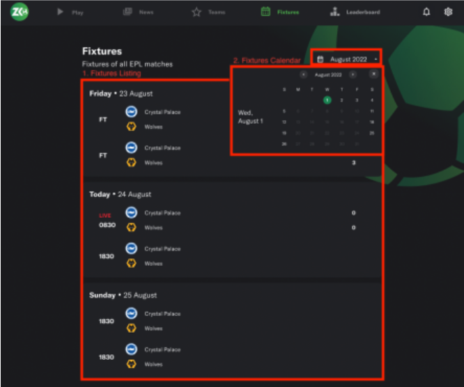
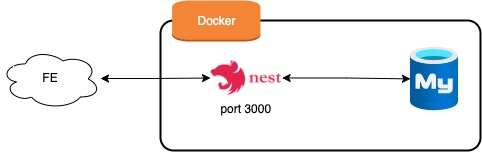
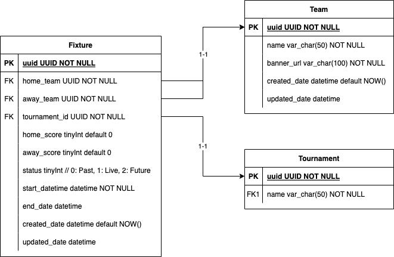
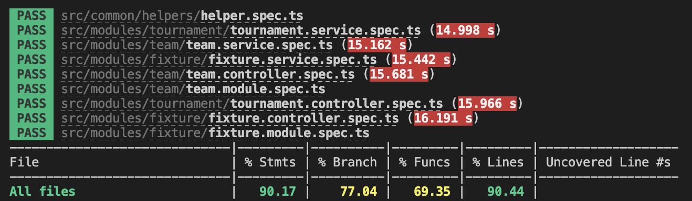
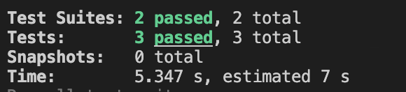
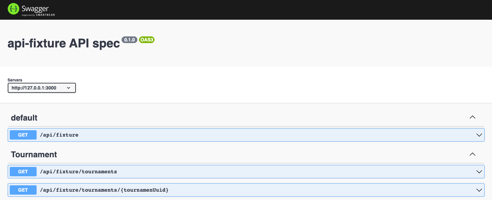
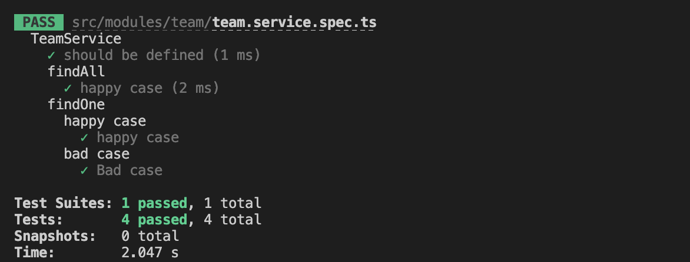
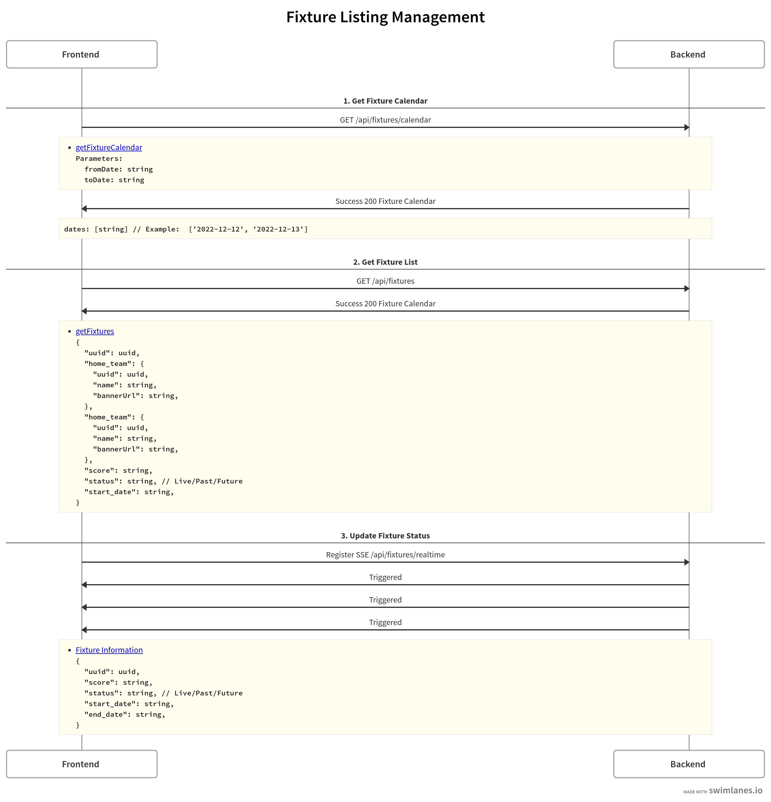

# Fixture Listing 

You have been tasked to build APIs to support our frontend (web & mobile) teams for the sections circled (in red) in the image above.
These sections are known as the Fixtures module, and we will need APIs to support Fixtures Listing and Fixtures Calendar to display
only dates with matches.

**🚨🚨🚨 Please note: This is not a production-ready application**
## Getting Started
###  Architecture

###  Database structure

**Technical Stack**

    - NestJs / TypeORM
    - NextJS
    - MySQL 8.0
    - Jest / Cypress
    - Additional: Husky / Pretty
### Prerequisites

What things you need to install

    Node.js v14.20
    yarn
    docker-compose (optional)

### Installing
#### With Docker

    1. Clone the repository
    2. Build docker: `docker-compose build`
    3. Run docker image: `docker-compose up -d`

#### Without Docker

    1. Clone the repository
    2. Install MySQL
        - Database: api_fixture
        - Username: assignment_db
        - Password: Abcd1234
        Credential above is default. 
        You can revise it in config directory (config/default.yaml)
    3. Install dependencies: `yarn`
    4. Start service at port 3000: `yarn start:dev`

## Usage
- Main site: http://localhost:3000
- Swagger url: http://localhost:3000/docs/fixture

You can also use my deployed doc at https://fixtures.jobfi.vn/docs/fixture

## Running the tests
### Manually Test 
#### Create Fixture

Swagger: http://localhost:3000/docs/fixture#/Fixtures%20Listing/FixtureController_create

    
    {
        "homeTeamUuid": "1",
        "awayTeamUuid": "2",
        "tournamentUuid": "1",
        "startDate": "2023-01-13T09:30:00.000Z",
        "endDate": "2023-01-13T12:00:00.000Z",
        "homeScore": 1,
        "awayScore": 0,
        "status": "2"
    }
   
#### Get Fixture
    
    page: number
    perpage: number
    fromDate: string
    toDate: string 

Swagger: http://localhost:3000/docs/fixture#/Fixtures%20Listing/FixtureController_findAll

    http://localhost:3000/api/fixture/fixtures?page=1&perpage=20&sort=%7B%0A%20%20%22createdAt%22%3A%20%22ASC%22%0A%7D&tournamentUuid=1&fromDate=2023-01-13&toDate=2023-01-31

### Unit Test
    - Run yarn `test:cov`
    - Testing Coverage: > 90%

### Integration Test
    - Please make sure you start docker or create database as default with port 3308
    You can config the test database in config/test.yaml
    - Run yarn `test:e2e`

### SSE Testing
    - Open sse_testing.html
    - When server update a fixture, a message will be sent to client
## Screenshots

## Flow

## What next
- Master/Slave database
- Add caching 
- Optimize Docker build
- Improve logging
- etc..
